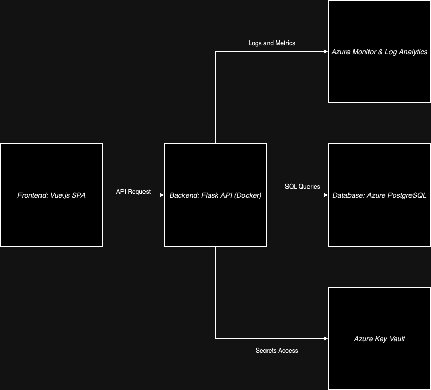
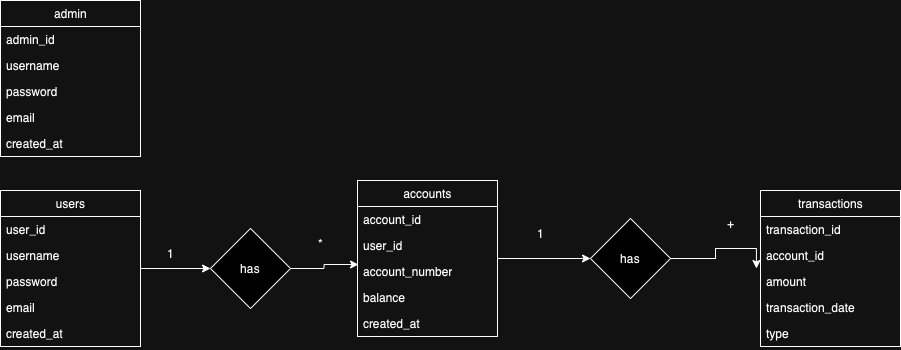
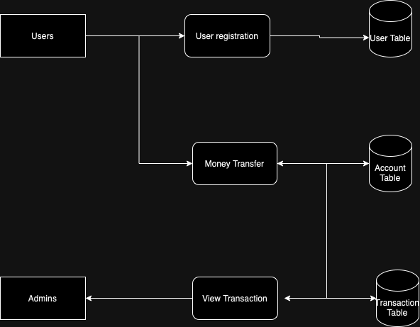
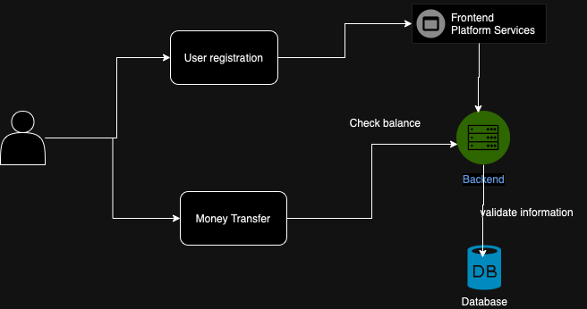

# Architecture Design

## Overview

The IE Bank application is designed with a microservices architecture, leveraging Azure services for scalability, security, and performance. The infrastructure comprises the following components:

- **Frontend:** Developed with Vue.js, served as static files.
- **Backend:** Built with Flask, containerized using Docker.
- **Database:** Managed PostgreSQL instance.
- **Monitoring and Logging:** Implemented using Azure Monitor and Log Analytics.
- **Secrets Management:** Handled by Azure Key Vault.

## Components

### 1. Frontend

- **Technology:** Vue.js
- **Deployment:** Azure Static Web Apps
- **Details:** The frontend is built as a Single Page Application (SPA) and deployed to Azure Static Web Apps, providing global distribution and SSL termination.

### 2. Backend

- **Technology:** Flask (Python)
- **Deployment:** Azure App Service for Containers
- **Details:** The backend API is containerized using Docker and deployed to Azure App Service, ensuring scalability and managed hosting.

### 3. Database

- **Technology:** PostgreSQL
- **Deployment:** Azure Database for PostgreSQL
- **Details:** A managed PostgreSQL instance is used to store application data, benefiting from built-in high availability and automated backups.

### 4. Monitoring and Logging

- **Services:** Azure Monitor, Log Analytics
- **Details:** Application performance and logs are monitored using Azure Monitor and Log Analytics, enabling proactive issue detection and resolution.

### 5. Secrets Management

- **Service:** Azure Key Vault
- **Details:** Sensitive information such as database connection strings and API keys are securely stored and accessed via Azure Key Vault.

## Architecture Diagram

# Entity Relationship Diagram

## Overview
The database is structured to store user, account, and transaction data securely and efficiently.

### Entities
- **Users:** Stores user information.
- **Accounts:** Stores account details linked to users.
- **Transactions:** Logs all transactions performed by users.
---

# Data Flow Diagram

## Overview
This diagram represents how data flows through the IE Bank system.

### Key Processes
- **Registration:** User data flows to the `Users` table.
- **Transactions:** User requests update `Accounts` and log `Transactions`.
- **Login:** Authentication verified against `Users` table.
---

# 12 Factor App Design

## Principles and Application

1. **Codebase:** Single GitHub repositories for infra, frontend, and backend.
2. **Dependencies:** Managed explicitly with `requirements.txt` (backend) and `package.json` (frontend).
3. **Config:** Environment variables handled via Azure Key Vault.
4. **Backing Services:** Database (PostgreSQL) and Storage (Azure Blob) are treated as attached resources.
5. **Build, Release, Run:** CI/CD pipelines separate build and release stages.
6. **Processes:** Stateless processes with data stored in backing services.
7. **Port Binding:** Backend exposed on specific ports, e.g., `5000`.
8. **Concurrency:** Horizontal scaling supported.
9. **Disposability:** Rapid startup/shutdown with resilient error handling.
10. **Dev/Prod Parity:** Identical environments for DEV, UAT, and PROD.
11. **Logs:** Centralized logging using Azure Log Analytics.
12. **Admin Processes:** Admin commands scripted and managed through pipelines.

---

# User Stories

## Title: User Registration
### Description
As a user, I want to register an account so that I can access banking features.

### Acceptance Criteria
- [X] User enters valid details and receives a confirmation email.
- [X] Duplicate emails are rejected.

## Title: Money Transfer
### Description
As a user, I want to transfer money to another account so that I can pay others.

### Acceptance Criteria
- [X] Transfer fails if the balance is insufficient.
- [X] Confirmation message shown after a successful transfer.
---

## Use Case Diagram

For more details, refer to the [CI/CD Pipelines](ci-cd.md) and [Monitoring](monitoring.md) sections.