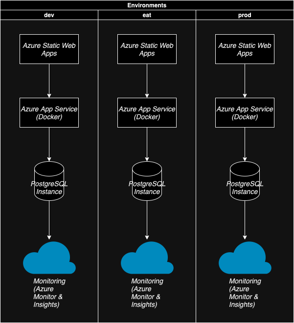

# Environments Design

## Overview

The development lifecycle of the IE Bank application is structured across three primary environments:

1. **Development (DEV)**
2. **User Acceptance Testing (UAT)**
3. **Production (PROD)**

Each environment is configured to mirror the production setup as closely as possible, ensuring consistency and reliability throughout the development and deployment process.

## Environment Configurations

### 1. Development (DEV)

- **Purpose:** Active development and initial testing.
- **Resources:**
  - **Frontend:** Deployed to a DEV-specific Azure Static Web App.
  - **Backend:** Deployed to a DEV-specific Azure App Service instance.
  - **Database:** Separate PostgreSQL instance for development data.
- **Access:** Restricted to the development team.

### 2. User Acceptance Testing (UAT)

- **Purpose:** Validation of features and fixes before production release.
- **Resources:**
  - **Frontend:** Deployed to a UAT-specific Azure Static Web App.
  - **Backend:** Deployed to a UAT-specific Azure App Service instance.
  - **Database:** Separate PostgreSQL instance with anonymized production data.
- **Access:** Available to stakeholders for testing and feedback.

### 3. Production (PROD)

- **Purpose:** Live environment serving end-users.
- **Resources:**
  - **Frontend:** Deployed to the production Azure Static Web App.
  - **Backend:** Deployed to the production Azure App Service instance.
  - **Database:** Primary PostgreSQL instance with live data.
- **Access:** Publicly accessible to end-users.

## Environment Diagram

