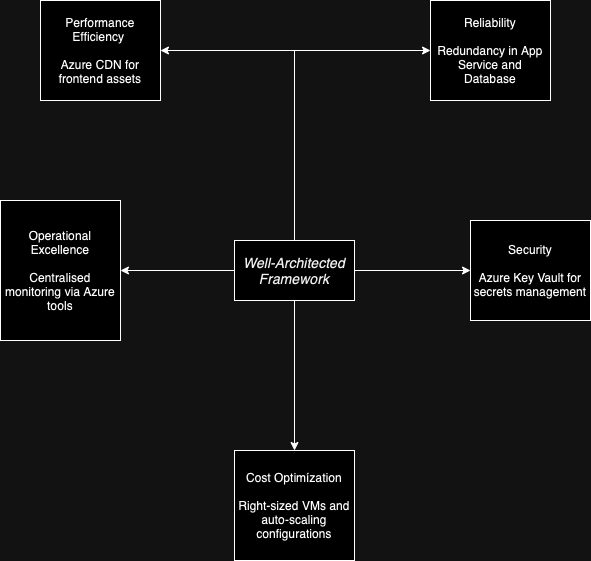

# Well-Architected Framework Design

## Overview

The IE Bank application architecture adheres to the principles of the Azure Well-Architected Framework, focusing on five key pillars:

1. **Reliability**
2. **Security**
3. **Cost Optimization**
4. **Operational Excellence**
5. **Performance Efficiency**

## 1. Reliability

- **Design Considerations:**
  - Implement redundancy for critical components.
  - Use Azure's availability zones for high availability.
- **Practices:**
  - Regular backups of the PostgreSQL database.
  - Health monitoring and automated failover mechanisms.

## 2. Security

- **Design Considerations:**
  - Secure sensitive data using Azure Key Vault.
  - Implement network security groups and firewalls.
- **Practices:**
  - Regular security assessments and penetration testing.
  - Use of managed identities for resource access.

## 3. Cost Optimization

- **Design Considerations:**
  - Right-size resources based on usage patterns.
  - Utilize Azure Cost Management tools.
- **Practices:**
  - Regular review of resource utilization.
  - Implement auto-scaling to manage load efficiently.

## 4. Operational Excellence

- **Design Considerations:**
  - Implement CI/CD pipelines for automated deployments.
  - Use Infrastructure as Code (IaC) with Bicep.
- **Practices:**
  - Continuous monitoring and logging.
  - Regular drills for disaster recovery scenarios.

## 5. Performance Efficiency

- **Design Considerations:**
  - Optimize database queries and indexing.
  - Use Azure CDN for static content delivery.
- **Practices:**
  - Regular performance testing and tuning.
  - Implement caching strategies where applicable.

## Well-Architected Framework Diagram

